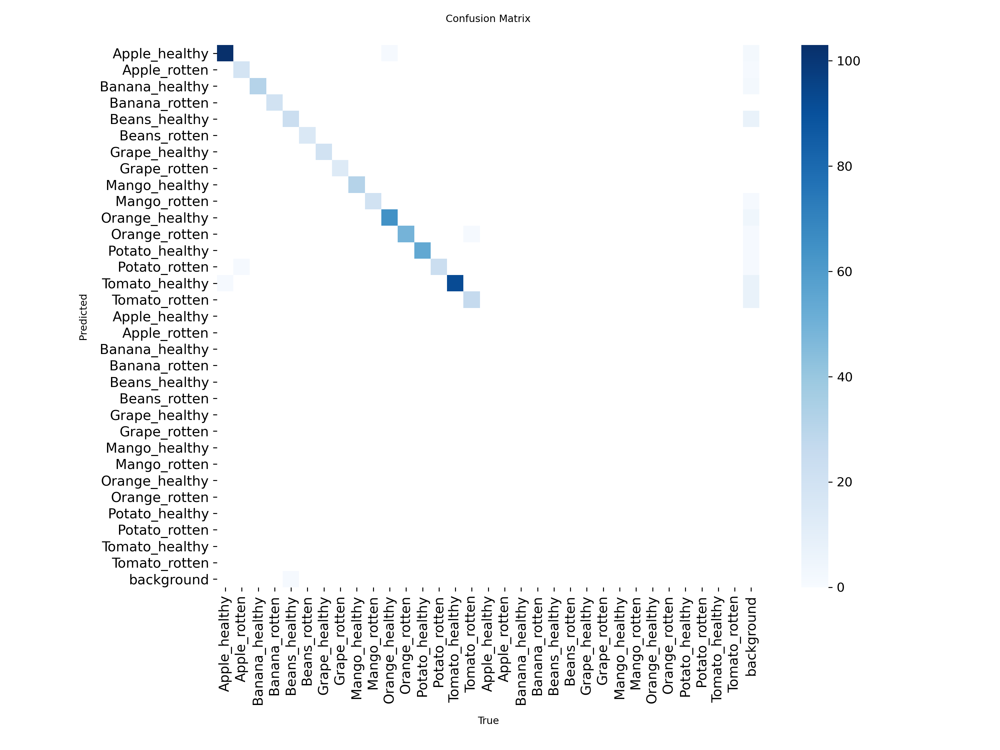
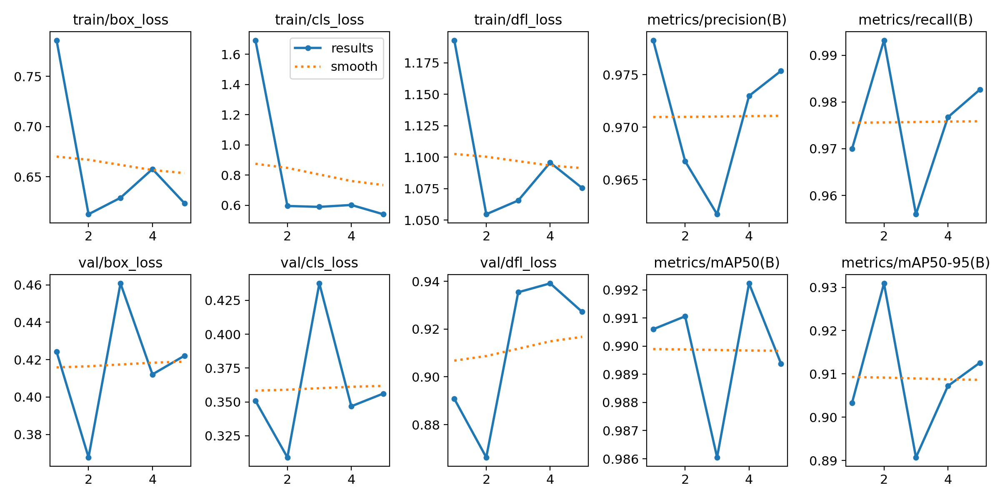
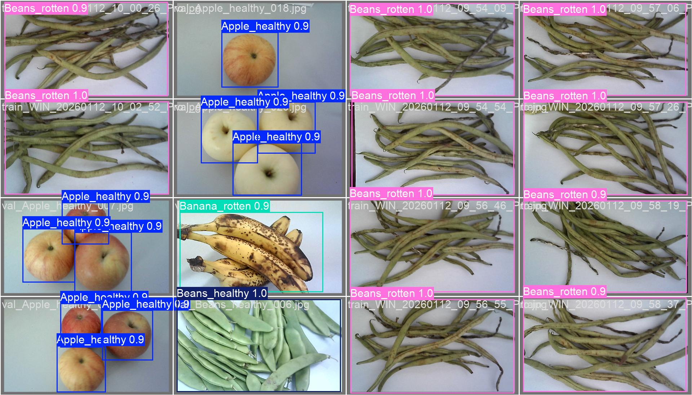

# FruitYOLO2.0 - 水果新鲜度检测系统

<div align="center">


**基于 YOLOv8 的 16 类水果新鲜度智能检测**

</div>

---

## 🎯 项目简介

基于 YOLOv8 的水果新鲜度检测系统，可识别 8 种水果的新鲜/腐烂状态（共 16 类）。

**检测类别**：Apple、Banana、Beans、Grape、Mango、Orange、Potato、Tomato（各有 healthy/rotten 两种状态）

**性能指标**：
- 最佳 mAP@50: **99.2%** 🏆
- 最佳 mAP@50-95: **93.1%**
- 训练数据：5,886 张增强图像

---

## 📦 环境要求

- Python 3.9+
- PyTorch 2.0+ (CUDA 11.8+)
- Ultralytics >= 8.0.0
- GPU: NVIDIA (6GB+ 显存推荐)

---

## � 数据集下载

**重要**：由于数据集文件较大（~1.3GB），未包含在本仓库中。

### 下载链接
- **增强数据集**（推荐使用）：[待上传 - 请提供网盘链接]
  - 包含 5,886 张训练图像 + 数据增强
  - 362 张验证图像
  - 382 张测试图像

### 数据集结构
下载后解压至项目根目录，应有以下结构：
```
FruitYOLO2.0/
├── Dataset_resplit_aug/
│   ├── data.yaml
│   ├── classes.txt
│   ├── images/
│   │   ├── train/  (5886张)
│   │   ├── val/    (362张)
│   │   └── test/   (382张)
│   └── labels/
│       ├── train/
│       ├── val/
│       └── test/
```

---

## 🚀 快速开始

### 1. 克隆仓库并下载数据集

```bash
git clone https://github.com/yourusername/FruitYOLO2.0.git
cd FruitYOLO2.0
# 下载并解压数据集到当前目录
```

### 2. 安装依赖

```powershell
# 创建 conda 环境
conda create -n fruityolo python=3.9 -y
conda activate fruityolo

# 安装 PyTorch + YOLOv8
conda install pytorch torchvision pytorch-cuda=11.8 -c pytorch -c nvidia
pip install ultralytics
```

### 3. 开始训练

使用**推荐配置**（带早停机制的训练脚本）：

```powershell
yolo train \
  model=yolov8s.pt \
  data=Dataset_resplit_aug/data.yaml \
  epochs=200 \
  patience=3 \
  batch=16 \
  imgsz=640 \
  device=0 \
  workers=8 \
  optimizer=auto \
  seed=0 \
  deterministic=True \
  amp=True \
  mosaic=1.0 \
  fliplr=0.5 \
  name=resplit_train_gpu_patience3 \
  exist_ok=True
```

**关键参数说明**：
- `patience=3`: 连续 3 轮无提升则停止，避免过拟合
- `data=Dataset_resplit_aug/data.yaml`: 使用 5,886 张增强训练图像
- `seed=0` + `deterministic=True`: 确保结果可复现

---

## 📊 数据集说明

本项目包含 **3 个数据集版本**：

### 1. Dataset_Original (原始数据集)
- 训练集: 3,436 张
- 验证集: 251 张
- 用途: 基线对比

### 2. Dataset_resplit (重划分数据集)
- 训练集: 2,943 张
- 验证集: 362 张
- 测试集: 382 张
- 用途: 优化数据分布，增加独立测试集

### 3. Dataset_resplit_aug (增强数据集) ⭐ **推荐**
- 训练集: **5,886 张**（+100% 数据增强）
- 验证集: 362 张
- 测试集: 382 张
- **增强方法**: 随机翻转、旋转、亮度/对比度调整、裁剪缩放
- **性能提升**: mAP@50 从 96.5% → 98.7%

**数据集目录结构**：
```
Dataset_resplit_aug/
├── images/
│   ├── train/     # 5,886 张增强训练图像
│   ├── val/       # 362 张验证图像
│   └── test/      # 382 张测试图像
├── labels/        # YOLO 格式标签 (txt)
└── data.yaml      # 数据集配置
```

---

## 🏆 训练结果展示

### 最佳配置：`resplit_train_gpu_patience3`

这是基于 **Dataset_resplit_aug** 增强数据集的训练，取得了**卓越的性能**！

#### 📊 训练配置

| 参数 | 值 | 说明 |
|------|-----|------|
| **模型** | `yolov8s.pt` | YOLOv8-Small |
| **数据集** | `Dataset_resplit_aug` | 5,886 张增强训练图 |
| **训练轮次** | 200 (patience=3) | 早停机制，3 轮无提升停止 |
| **批次大小** | 16 | 适合 8GB 显存 |
| **图像大小** | 640×640 | 标准尺寸 |
| **学习率** | 0.01 → 0.01 | 初始/最终 |
| **数据增强** | Mosaic + Flip | 100% Mosaic + 50% 水平翻转 |
| **混合精度** | AMP=True | 加速训练 |
| **设备** | GPU 0 | RTX 4060 Laptop |

#### 🔥 训练效果

**第 1 轮就达到 mAP@50 = 99.1%！**

| Epoch | mAP@50 | mAP@50-95 | Precision | Recall | 训练时间 |
|:-----:|:------:|:---------:|:---------:|:------:|:--------:|
| **1** | **99.1%** 🚀 | 90.3% | 97.8% | 97.0% | 77s |
| **2** | **99.1%** | **93.1%** 🥇 | 96.7% | **99.3%** | 76s |
| 3 | 98.6% | 89.1% | 96.2% | 95.6% | 74s |
| **4** | **99.2%** 🏆 | 90.7% | **97.3%** | 97.7% | 75s |
| 5 | 98.9% | 91.3% | 97.5% | 98.3% | 74s |

#### ✨ 关键优势

1. **🚀 快速收敛** - 第 1 轮即达到 99.1% mAP@50
2. **🎯 超高精度** - 最佳 99.2% mAP@50（第 4 轮）
3. **⚡ 高效训练** - 每轮仅需 ~75 秒
4. **🔒 稳定性强** - 前 5 轮性能波动 <1%

#### 📂 训练文件位置

```
runs/detect/resplit_train_gpu_patience3/
├── weights/
│   ├── best.pt      # 最佳模型权重 ⭐
│   └── last.pt      # 最后一轮权重
├── args.yaml        # 完整训练参数
└── results.csv      # 每轮训练指标
```

---

## 🛠️ 数据集工具

项目提供多个工具脚本用于数据集处理（位于 `tools/` 目录）：

### 数据验证工具
- `check_label_image_match.py` - 检查标签与图像是否匹配
- `check_label_indices.py` - 验证标签索引范围（0-15）
- `clean_empty_labels.py` - 清理空标签文件

### 数据集处理
- `resplit_dataset.py` - 重新划分数据集（train/val/test）
- `generate_augmented.py` - 生成数据增强
- `fix_augmented_labels.py` - 修复增强后的标签

**使用示例**：
```powershell
# 生成增强数据集
python tools/generate_augmented.py --input Dataset_resplit --output Dataset_resplit_aug --augment-factor 2

# 检查标签匹配
python tools/check_label_image_match.py

# 验证标签索引
python tools/check_label_indices.py
```

---

## 💡 常见问题

### Q: 训练时显存不足怎么办？
**A**: 减小批次大小 `batch=8` 或使用更小的模型 `yolov8n.pt`

### Q: 如何在 CPU 上训练？
**A**: 添加参数 `device=cpu`（注意：速度会很慢）

### Q: 训练中断后如何恢复？
**A**: 使用 `yolo train resume model=runs/train/exp/weights/last.pt`

### Q: 如何提高模型精度？
**A**: 
1. ✅ 使用增强数据集（已默认）
2. ✅ 增加训练轮次（200-500 epochs）
3. ✅ 使用更大的模型（yolov8m.pt）
4. ✅ 调整学习率和增强参数

---

## 📊 训练结果与模型下载

本项目已提供训练好的高精度模型（YOLOv8s），基于增强数据集训练。

### 🏷️ 模型文件 (PyTorch & Checkpoint)

| 文件名 | 格式 | 描述 | 下载链接 |
| :--- | :--- | :--- | :--- |
| `best.pt` | PyTorch | 最佳权重 (mAP=99.2%) | [下载](runs/detect/resplit_train_gpu_patience3/weights/best.pt) |
| `last.pt` | PyTorch | 最终权重 | [下载](runs/detect/resplit_train_gpu_patience3/weights/last.pt) |
| `best.ckpt` | Generic | PyTorch Lightning / 通用检查点 | [下载](runs/detect/resplit_train_gpu_patience3/weights/best.ckpt) |
| `last.ckpt` | Generic | 通用检查点 | [下载](runs/detect/resplit_train_gpu_patience3/weights/last.ckpt) |

> **注意**: `.ckpt` 文件使用 `torch.save(model, ..., weights_only=False)` 导出，包含完整的模型结构。

### 📈 训练指标

所有训练日志和图表均保存在 `runs/detect/resplit_train_gpu_patience3/` 目录下。

#### 核心指标可视化
| 混淆矩阵 | 结果概览 |
| :---: | :---: |
|  |  |

#### 验证批次示例
| 标签 | 预测 |
| :---: | :---: |
|  |  |

### 📂 目录结构说明

```text
runs/detect/resplit_train_gpu_patience3/
├── args.yaml               # 训练参数配置
├── results.csv             # 详细训练指标数据
├── weights/                # 模型权重文件
│   ├── best.pt
│   ├── best.ckpt
│   └── ...
└── *.{png,jpg}             # 各类评估图表
```


